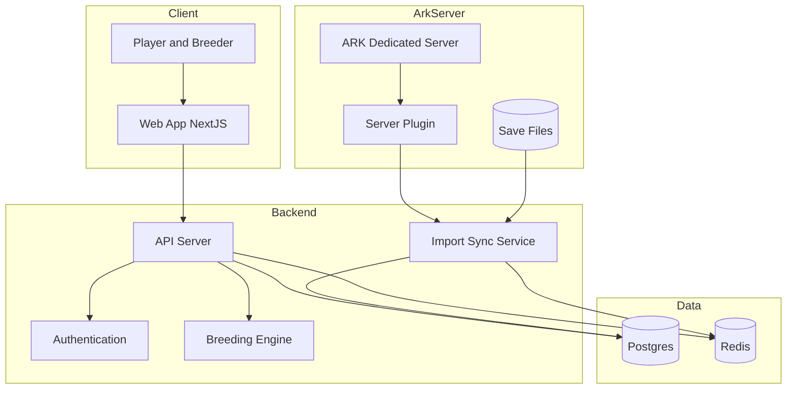

# 🧬 ArkHelix
> A web-based breeding & mutation manager for **ARK: Survival Ascended**

ArkHelix is a full-stack web application designed to help breeders **track tames, mutations, lineages, and breeding plans** — with optional **automatic import from a dedicated ARK server**.

Built for serious breeders. No spreadsheets. No guessing.

---

## ✨ Features

- 📊 Track all tamed creatures (stats, mutations, lineage)
- 🧬 Automatic mutation & breeding calculations
- 🧠 Best-pair recommendations for target stats
- 🔄 Auto-import from ARK dedicated servers (plugin or save parsing)
- 📁 Tribe-based organization
- 📤 Export breeding plans (PDF / CSV)
- ⚡ Fast recalculations with caching

---

## 🏗 Architecture Overview

## 🧰 Tech Stack

Built with modern, boring-in-a-good-way tech that scales and doesn’t fight you.

### Frontend
- **Next.js** – React framework for production  
  https://nextjs.org
- **TypeScript** – Type-safe sanity  
  https://www.typescriptlang.org
- **Tailwind CSS** – Utility-first styling  
  https://tailwindcss.com

### Backend
- **Django** – Batteries-included Python backend framework
 https://www.djangoproject.com

### Data & Caching
- **PostgreSQL** – Relational database  
  https://www.postgresql.org
- **Redis** – In-memory cache & queueing  
  https://redis.io

### Infrastructure & Tooling
- **Docker** – Containerization  
  https://www.docker.com
- **Mermaid** – Architecture & flow diagrams  
  https://mermaid.js.org

## 🧪 Quick Breeding Explained

For anyone who doesn’t want a wall of text — this is the **standard ARK mutation breeding loop**, visualized.

> Clean females + one male → check baby → keep only useful mutations → replace → repeat until cracked.

